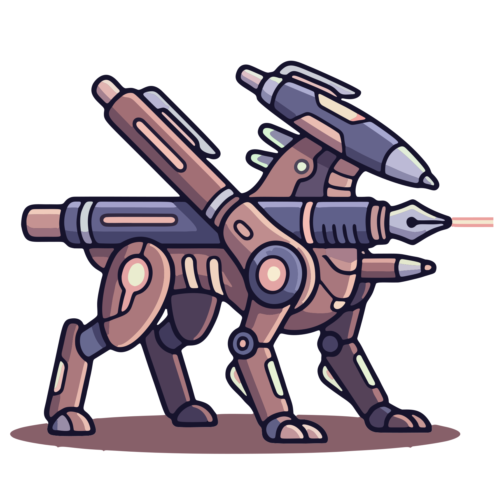

<div align="center">
  
  <h1>whiteboard</h1>

  <a href="https://github.com/Tanq16/whiteboard/actions/workflows/release.yaml"></a>&nbsp;<a href="https://github.com/Tanq16/whiteboard/releases"></a><br><br>
  <a href="#features">Features</a> &bull; <a href="#install">Install</a> &bull; <a href="#usage">Usage</a>
</div>

---

whiteboard is a minimalist, local-first infinite canvas whiteboard served by a single Go binary. It provides a clean, distraction-free space for sketching, diagramming, and handwritten notes with pressure-sensitive stylus strokes. It is not an online multi-user suite or a heavy vector illustration editor.

## Features

- Infinite pan and zoom canvas with multi-touch gestures and mouse wheel navigation.
- Smooth pressure-sensitive pen drawing backed by Catmull-Rom spline interpolation.
- Palm rejection ignoring touch drawing inputs while pen mode is active.
- Canvas element selection with drag box marquee selection, Command-click multi-selection, and group translation.
- Single-point dot selection and manipulation for quick taps and pen points.
- Clean vector primitives for lines, arrows, rectangles, and circles.
- Handwritten text tool with embedded Virgil font and variable font sizing.
- Pure bar stroke width and text size picker spanning 0.5px to 24px.
- Ephemeral laser pointer trail with smooth tapering and glow for live presentations.
- Popover modals for color swatches, size bars, and shape selection.
- High-resolution PNG and SVG export directly from canvas drawings.
- PWA installable with standalone display and Catppuccin Mocha palette.

## Install

### GitHub Releases

Pre-compiled standalone binaries are available on the [releases page](https://github.com/Tanq16/whiteboard/releases):

| Platform | Architecture | Binary |
|---|---|---|
| Linux | amd64 (x86_64) | `whiteboard-linux-amd64` |
| Linux | arm64 (aarch64) | `whiteboard-linux-arm64` |
| macOS | Apple Silicon (arm64) | `whiteboard-darwin-arm64` |
| macOS | Intel (amd64) | `whiteboard-darwin-amd64` |

### Building from Source

Requires Go 1.27 or later.

```bash
git clone https://github.com/Tanq16/whiteboard.git
cd whiteboard
make assets
make build
```

## Usage

Start the whiteboard server:

```bash
./whiteboard serve --port 8080
```

### Flags

| Flag | Default | Description |
|---|---|---|
| `--port` | `8080` | Port for the local web server |
| `--host` | `127.0.0.1` | Bind address for the server |
| `--debug` | `false` | Enable debug logging output |

### Keyboard Shortcuts

| Key | Action |
|---|---|
| `V` or `1` | Select tool |
| `H` | Hand / Pan tool |
| `P` | Pen tool |
| `K` | Laser pointer |
| `R` | Rectangle tool |
| `C` | Circle tool |
| `L` | Line tool |
| `A` | Arrow tool |
| `T` | Text tool |
| `Cmd` / `Ctrl` + click | Toggle element in selection |
| `Backspace` / `Delete` | Delete selected elements |
| `Cmd` / `Ctrl` + `Z` | Undo action |
| `Cmd` / `Ctrl` + `Y` | Redo action |
| `+` / `-` | Zoom in / Zoom out |
| `0` | Reset zoom to 100% |
| `Escape` | Deselect elements or close menus |

## Notes

- **Local-first execution**: All canvas operations and drawings stay strictly on your local machine with zero external network requests.
- **Self-contained binary**: All web assets, styles, and fonts are vendored into the compiled binary via Go embed.
